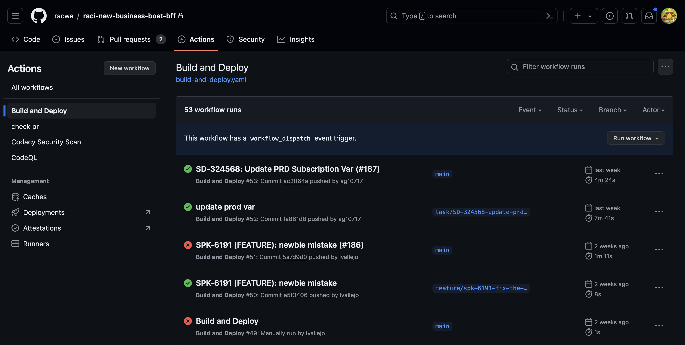
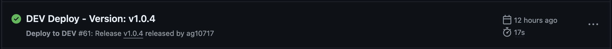
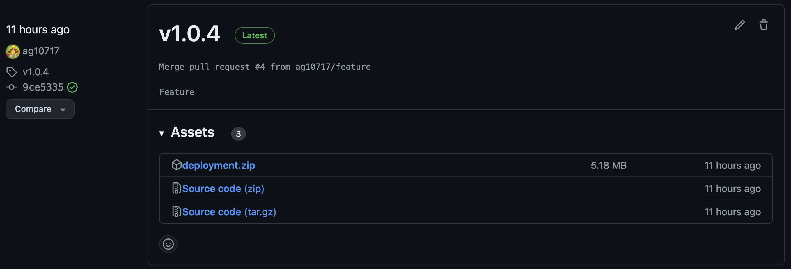

# Workflow Structure

This example exists to enhance the deployment patterns for packaged apps like that of the React Frontends and the .NET backends.

## Why

Currently when using either Azure DevOps or Github Actions there is no repeatable way to deploy the same packaged version of code. The ability to deploy an old version hinges on the ability to see the last known pipeline that completed to Production.

In Azure DevOps pipelines can be "retained", but in Github Actions the workflow run is only kept for a number of days defined by the Github Adminitstrator.

The main principal behind a new pattern is to:

* Make it easier to identify currently deployed versions of code
* Make it easier to redeploy by application version
* Allow deployment of apps outside of CI/CD by obtaining the built package

> NOTE: Currently I have only demonstrated this pattern in Github Actions; but given the way CI/CDs are built, this should be repeatable in any platform.

## How

If we limit our looking glass to Github Actions, it can be extremely difficult to identify which workflow run deployed the latest to a specific environment. This is because the workflow run just performs the action; it has no particular want or need to track your version deployment for you.

If we look at this image below, is there any definitive way to say a run is deployed to Production, or any other environment? I would say "no".



Given that statement, we should look to find a solution that does that for us; in comes "Releases". Releases aren't specific to Github Actions, they are a function of Github and other code management platforms, for example the Gitlab platform also has releases.

Releases are put together based on a tag, so with the tag existing and defining the code at a certain point in time by `vx.x.x`, we can add our build asset to that release (built from that point in time). Now that we have that given release version, `v1.1.4`, if we were to run some kind of deployment targeting the assests in that release, we'll always deploy `v1.1.4` to our environment.

We could trigger a manual deployment targeting whichever release up to the point in which the release would no longer exist. This is a repeatable way to deploy new code, roll back code, or manually use the build to validate other function platforms.

## Keeping Things Separate

Now when it comes to redploying code our current pattern defines all the jobs for environment deployment and build together. Meaning that in Github Actions if you triggered the `workflow_dispatch` (manual run) you would always be building the code again, even when it's unchanged, just to fire a new environmental deployment.

By separating out the Build (and Test) stage into it's own workflow, we're now given the ability to build our code on every push, create a release for that "unstable", or "stable" (when it's merged in to our main/default branch) version, and ultimately call that feature "completed".

Release Management now has the opportunity to say which application version should be released at which time to whichever environment and development can continue unimpeded since previous builds would be locked to that release.

With this approach we now also have the ability to automatically run an environment when a release is `released`.

> NOTE: `released` is a keyword provided by the Github event to mark the state of the release, particular event types can trigger different workflows.

This let's us keep the ability to automatically push code to the Development environment and we achieve this by using Github Actions built-in events, and in this particular case the event is called `release`.

So, within our workflow structure, in our DEV workflow we define the case like this:

```yaml
name: Deploy to DEV
run-name: >-
  ${{ github.event_name == 'release'
    && format('DEV Deploy - Version: {0}', github.ref_name)
    || format('DEV Deploy - Version: {0}', inputs.tag_name) }}

# Can run from other workflows or manually triggered
# run from release when build is completed, but if you want to run manually then you need to pass the input of tag_name
# if run on release then this file needs to be working at the point in time
on:
  release:
    types: [released]
  workflow_dispatch:
    inputs:
      tag_name:
        type: string
```

This now tells this workflow that whenever a new release is `released` (which is when the build and publish workflow is complete) that we want to run. This also gives us the added benefit of using the `run-name` option in our workflow.

Since `run-name` can only use values from either the `github` context or `inputs`, emulating the rename that was done in Azure DevOps was impossible to do when the run was in progress. Now with this trigger the `github.ref_name` or `inputs.tag_name` on a either event can be used to name the run and show the version being deployed. When we view the run in the Action tab in Github we can see a value like `DEV Deploy - Version: v1.1.4`



## Build & Release

Now that Build, Test, and Release are separated from the deployments we can choose what versions of the packaged code we want to deploy to where.

Lets take a look at these example Build and Release processes.

> NOTE: This uses an arbitrary method to increment the tag number for this example, but any versioning scheme would ultimately work.

### Building

There are 2 cases where we want to build and release our package. They are either on:

* a push to a feature branch, or successful merge into our main branch (which would also constitute a push event); or
* they are on a manual trigger from a user

We can define this in our workflow here:

```yaml
name: Build & Test
run-name: Build & Test
#
# Can run on pushes and manually triggered
on:
  push:
    branches:
      - 'feature'
      - 'main'
    paths:
      - "src/**"
  workflow_dispatch:
```

We are required to specify the branches that we want to trigger these events on because of the way the tagging mechanism would work. When a tag is created that also constitutes a push, which would create an endless loop of this workflow.

We can also combine this with the `paths` property to say we only want to trigger a build and release when the source code changes.

> NOTE: I would have liked to use the built-in `tags-ignore:` property for `push` but when that is added alone it prevents any push from triggering the workflow

Now that our workflow is firing lets look at the actions we perform.

> NOTE: Just keep in mind the items we are building and deploying in this workflow are examples and a simple approach to demonstrate how this work. Currently it builds a GO Handler for AWS Lambda and deploys to such.

> NOTE: GO was choosen as it has a build step that we can complete that is built-in to GO.

```yaml
      - name: Build
        run: |
          echo "Moving to SRC Directory"

          pushd src
          echo "Running GO Build"
          make build-aws
          echo "Moving back to Repo Root"
          popd

          echo "Completed BUILD"
      - name: Packaging
        run: |
          echo "Zipping Deployment"
          zip deployment.zip bootstrap
          echo "Completed PACKAGING"
```

Our "Build" job simply runs `make build-aws` which in the Makefile just runs `go build -o bootstrap main.go`.

We then package this up into a zip that can be used to upload to AWS Lambda and then publish that artifact. To which we can say our Build job is considered complete.

```yaml
      - name: Publish
        uses: actions/upload-artifact@v4
        with:
          name: deployment
          path: ./deployment.zip
```

The next job that we define is to create the release. In this job we run our versioning and then use the github cli push a new release.

```yaml
      - name: "Versioning"
        #... all our versioning action - you can view .github/workflows/build-and-test.yaml to see the full script
      - name: "Download Build"
        uses: actions/download-artifact@v4
        with:
          name: deployment
          path: ./deployment
      - name: Create Release
        env:
          GH_TOKEN: ${{ secrets.PA_TOKEN }}
          RELEASE_VERSION: ${{ steps.get-release-version.outputs.RELEASE_VERSION }}
          REF_NAME: ${{ github.ref_name }}
        run: |
          echo "Creating Release"
          gh release create $RELEASE_VERSION --target $REF_NAME --title $RELEASE_VERSION './deployment/deployment.zip'
```

There are a few items that we require for this release:

| Property | Usage |
|----------|-------|
| RELEASE_VERSION | The tag number we created in the Versioning step |
| REF_NAME | From github the source branch that triggered the workflow |
| --title | The title that will be used for the release |
| Assets | The assets that will be attached to the release |

That's it we've completed our build and created a release that can be deployed later. We've used our workflow to precisely set out what it was required to do - Build and Test our application and create a new release.

If we take a look at our releases in Github, we'll see the version we created and the asset `deployment.zip` attached to it:


## Deployment

Now we're ready to take our release to the masses. We've already covered how a Development environment would use the `release` github event to fire off automatically, but what about if we want to deploy a previous version?

A user could navigate to the Actions tab in Github, open the workflow for "Deploy to DEV" and use the `workflow_dispatch` to trigger a new run. This is ultimately where our build efforts start to pay off, we can then trigger from the main (or other branch) and pass an input giving the tag version that we want to deploy.

So at any given point in time, as long as the release/tag exists, we can deploy that version again. Let's take a look a the deployment actions; for DEV we make exceptions for the `release` trigger type:

### Actions

```yaml
      - name: Deployment
        env:
          TAG_NAME: ${{ inputs.tag_name }}
          REF_NAME: ${{ github.ref_name }}
          EVENT_NAME: ${{ github.event_name }}
          GH_TOKEN: ${{ secrets.PA_TOKEN }}
          AWS_ACCESS_KEY_ID: ${{ secrets.AWS_ACCESS_KEY }}
          AWS_SECRET_ACCESS_KEY: ${{ secrets.AWS_SECRET_ACCESS_KEY }}
          AWS_DEFAULT_REGION: ap-southeast-2
        run: |

          if [[ $EVENT_NAME == "release" ]]; then
            echo "Download Release: $REF_NAME"
            gh release download $REF_NAME --pattern "deployment.zip"
          else
            echo "Download Release: $TAG_NAME"
            gh release download $TAG_NAME --pattern "deployment.zip"
          fi
          echo "Download Complete"

          echo "Running Deployment"
          aws lambda update-function-code --function-name "helloworld-go-dev" --zip-file "fileb://deployment.zip"
          echo "Completed Updating Function Code"
```

We do this because our Development deployment has the auto trigger where a release passes in the formation as the `REF_NAME`; we then also have the ability to take the standard approach that all other environments will have where we can pass in the input of `tag_name`.

The comparison to other environments are below:

```yaml
      - name: Deployment
        env:
          TAG_NAME: ${{ inputs.tag_name }}
          GH_TOKEN: ${{ secrets.PA_TOKEN }}
          AWS_ACCESS_KEY_ID: ${{ secrets.AWS_ACCESS_KEY }}
          AWS_SECRET_ACCESS_KEY: ${{ secrets.AWS_SECRET_ACCESS_KEY }}
          AWS_DEFAULT_REGION: ap-southeast-2
        run: |
          echo "Download Release: $TAG_NAME"
          gh release download $TAG_NAME --pattern "deployment.zip"
          echo "Download Complete"

          echo "Running Deployment"
          aws lambda update-function-code --function-name "helloworld-go-sit" --zip-file "fileb://deployment.zip"
          echo "Completed Updating Function Code"
```

### Triggers

Now let's check out the trigger differences between Development and other environments:

```yaml
name: Deploy to DEV
run-name: >-
  ${{ github.event_name == 'release'
    && format('DEV Deploy - Version: {0}', github.ref_name)
    || format('DEV Deploy - Version: {0}', inputs.tag_name) }}

# Can run from other workflows or manually triggered
# run from release when build is completed, but if you want to run manually then you need to pass the input of tag_name
# if run on release then this file needs to be working at the point in time
on:
  release:
    types: [released]
  workflow_dispatch:
    inputs:
      tag_name:
        type: string
```

> NOTE: This also has a special `run-name` condition to change the value of the run name to match either the release ref_name or the input. This is based off the event_name being `release` or not.

And any others are:

```yaml
name: Deploy to SIT
run-name: "SIT Deploy - Version: ${{ inputs.tag_name }}"

# Can run from other workflows or manually triggered
on:
  workflow_dispatch:
    inputs:
      tag_name:
        type: string
```

These separations help us automaticcally test out the infrastructure in a development environment to validate it's usage. But means that a developer just has to produce the code and ensure that the build passes.

When the business is ready to move to higher environments they should be triggered for whatever version they need.
